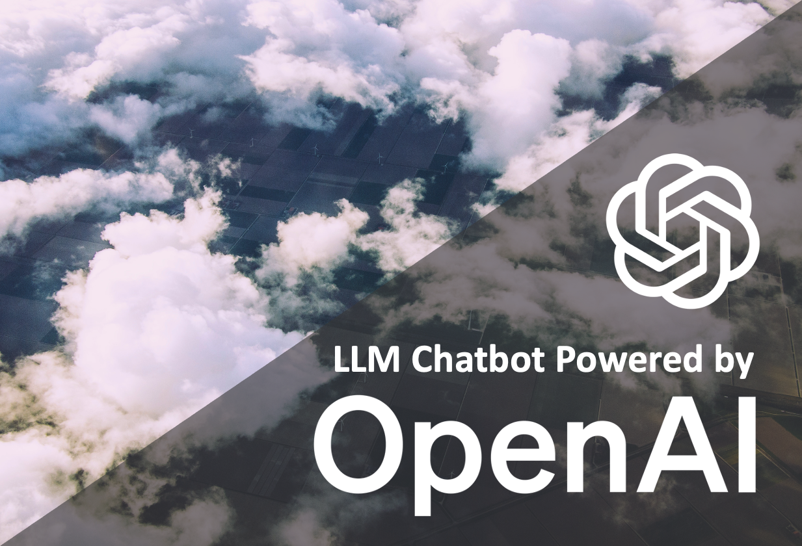
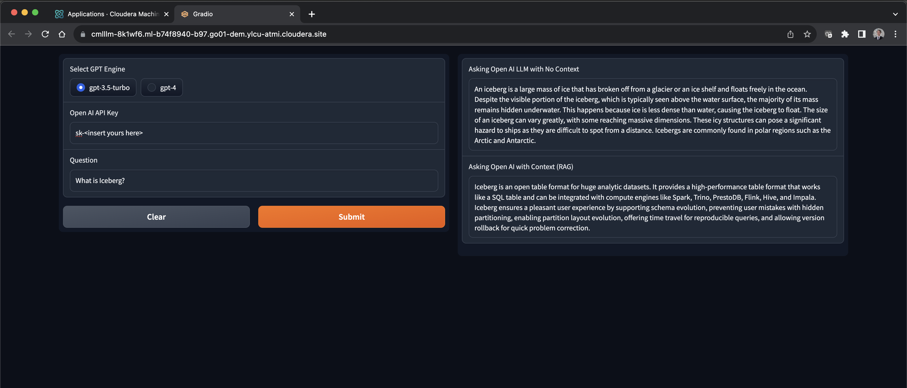
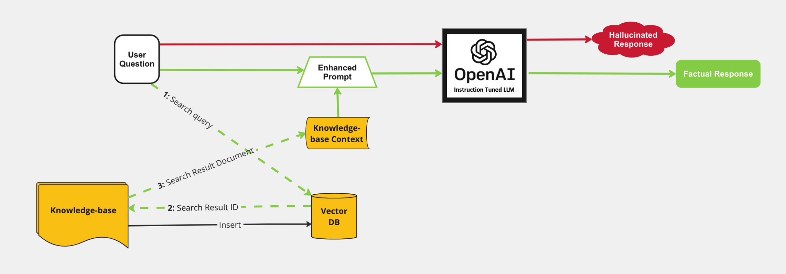

# OpenAI Chatbot Leveraging GPT 3.5 and GPT 4

This repository demonstrates how to use OpenAI's pre-trained instruction-following LLM (Large Language Model) to build a ChatBot-like web application. The responses of the LLM are enhanced by giving it context from an internal knowledge base. This context is retrieved by using an open source Vector Database to do semantic search with OpenAI's API. 





Unlike its sister AMP, this model uses OpenAI for semantic search and therefore the information you populate in the `/data` folder is part of the external API call. It requires access to the OpenAI servers and as such will not perform in an airgapped environment. By using OpenAI for the semantic search, the user has access to the latest incredibly capable models by OpenAI for accelerating insights with fast, high quality responses.

> **IMPORTANT**: Please read the following before proceeding.  By configuring and launching this AMP, you will cause https://huggingface.co/sentence-transformers/all-MiniLM-L12-v2, which is a third party embedding model, to be downloaded and installed into your environment from the third party’s website.  Please see https://huggingface.co/sentence-transformers/all-MiniLM-L12-v2 for more information about the embedding model, including the applicable license terms. Additionally, you will be using OpenAI's API to access semantic search responses and send data from your environment into theirs. Please see https://openai.com/policies/terms-of-use for more information about their API, including the applicable license terms. If you do not wish to download and install the sentence transformers library, or access OpenAI's API do not deploy this repository.  By deploying this repository, you acknowledge the foregoing statement and agree that Cloudera is not responsible or liable in any way for the embedding model or the OpenAI API. Author: Cloudera Inc.

## Table of Contents 
#### README
* [Enhancing Chatbot with Enterprise Context to reduce hallucination](#enhancing-chatbot-with-enterprise-context-to-reduce-hallucination)
  * [Retrieval Augmented Generation (RAG) Architecture](#retrieval-augmented-generation--rag--architecture)
* [Requirements](#requirements)
* [Project Structure](#project-structure)
  * [Implementation](#implementation)
* [Technologies Used](#technologies-used)

#### Guides
* [Customization](guides/customization.md)
    * [Knowledgebase](guides/customization.md#knowledgebase)
    * [Models](guides/customization.md#Model)
* [Troubleshooting](guides/troubleshooting.md)
    * [AMP Failures](guides/troubleshooting.md#amp-failures)
    * [Limitations](guides/troubleshooting.md#limitations)

## Enhancing Chatbot with Enterprise Context to reduce hallucination

When a user question is directly sent to the open-source LLM, there is increased potential for halliucinated responses based on the generic dataset the LLM was trained on. By enhancing the user input with context retrieved from a knowledge base, the LLM can more readily generate a response with factual content. This is a form of Retrieval Augmented Generation.

For more detailed description of architectures like this and how it can enhance NLP tasks see this paper: [Retrieval-Augmented Generation for Knowledge-Intensive NLP Tasks
](https://arxiv.org/abs/2005.11401)

### Retrieval Augmented Generation (RAG) Architecture
- Knowledge base Ingest into Vector Database
  - Given a local directory of proprietary data files (in this example 11 documentation files about CML)
  - Generate embeddings with an open sourced pretrained model for each of those files
  - Store those embeddings along with document IDs in a Vector Database to enable semantic search
- Augmenting User Question with Additional Context from Knowledge Base
  - Given user question, search the Vector Database for documents that are semantically closest based on embeddings
  - Retrieve context based on document IDs and embeddings returned in the search response
- Submit Enhanced prompt to LLM to generate a factual response
  - Create a prompt including the retrieved context and the user question
  - Return the LLM response in a web application

## Requirements

#### Resource Requirements
This AMP creates the following workloads with resource requirements:
- CML Session: `1 CPU, 4GB MEM`
- CML Jobs: `1 CPU, 4GB MEM`
- CML Application: `2 CPU, 8GB MEM`

#### External Resources
This AMP requires pip packages and models from huggingface and openai. Depending on your CML networking setup, you may need to whitelist some domains:
- pypi.python.org
- pypi.org
- pythonhosted.org
- huggingface.co
- openai.com
- api.openai.com

## Project Structure
### Folder Structure

The project is organized with the following folder structure:
```
.
├── 0_session-resource-validation/  # Script for checking CML workspace requirements
├── 1_session-install-deps/   # Setup script for installing python dependencies
├── 2_job-download-models/    # Setup scripts for downloading pre-trained models
├── 3_job-populate-vectordb/  # Setup scripts for initializing and populating a vector database with context documents
├── 4_app/                    # Backend scripts for launching chat webapp and making requests to locally running pre-trained models
├── data/                     # Sample documents to use to context retrieval
├── utils/                    # Python module for functions used for interacting with pre-trained models
├── images/
├── README.md
└── LICENSE.txt
```
## Implementation
### `data/`
This directory stores all the individual sample documents that are used for context retrieval in the chatbot application
- Sourced from:
  - [CML](https://docs.cloudera.com/machine-learning/cloud/index.html)
  - [Iceberg](https://iceberg.apache.org/docs/1.2.0/)
  - [Ozone](https://docs.cloudera.com/cdp-private-cloud-base/7.1.8/ozone-overview/topics/ozone-introduction.html)

### `1_session-install-deps`
- Install python dependencies specified in 1_session-install-deps/requirements.txt

### `2_job-download-models`
Definition of the job **Download Models** 
- Directly download specified models from huggingface repositories
- These are pulled to new directories models/llm-model and models/embedding-model

### `3_job-populate-vectordb`
Definition of the job **Populate Vector DB with documents embeddings**
- Start the milvus vector database and set database to be persisted in new directory milvus-data/
- Generate embeddings for each document in data/
- The embeddings vector for each document is inserted into the vector database
- Stop the vector database

### `4_app`
Definition of the application `CML LLM Chatbot`
- Start the milvus vector database using persisted database data in milvus-data/
- Start gradio interface 
- The chat interface performs both retrieval-augmented LLM generation and regular LLM generation for bot responses.

## Technologies Used
#### Open-Source Models and Utilities
- [all-MiniLM-L12-v2](https://huggingface.co/sentence-transformers/all-MiniLM-L12-v2/tree/9e16800aed25dbd1a96dfa6949c68c4d81d5dded)
   - Vector Embeddings Generation Model
- [gpt-3.5-turbo](https://platform.openai.com/docs/api-reference/introduction)
   - Instruction-following Large Language Model by OpenAI
- [gpt-4](https://platform.openai.com/docs/api-reference/introduction)
   - Instruction-following Large Language Model by OpenAI
- [Hugging Face transformers library](https://pypi.org/project/transformers/)
#### Vector Database
- [Milvus](https://github.com/milvus-io/milvus)
#### Chat Frontend
- [Gradio](https://github.com/gradio-app/gradio)

## Deploying on CML
There are two ways to launch this prototype on CML:

1. **From Prototype Catalog** - Navigate to the Prototype Catalog on a CML workspace, select the "OpenAI Chatbot Leveraging GPT 3.5 and GPT 4" tile, click "Launch as Project", click "Configure Project"
2. **As ML Prototype** - In a CML workspace, click "New Project", add a Project Name, select "ML Prototype" as the Initial Setup option, copy in the [repo URL](https://github.com/cloudera/CML_AMP_OpenAI_Chatbot_Leveraging_GPT_3.5_and_GPT_4), click "Create Project", click "Configure Project"
